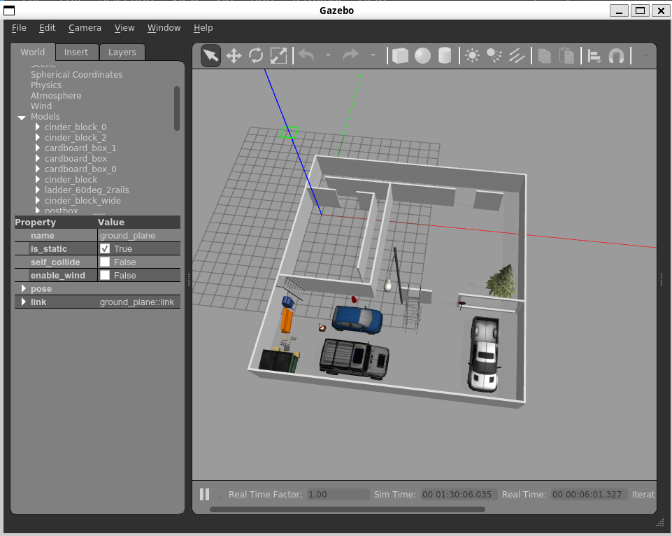
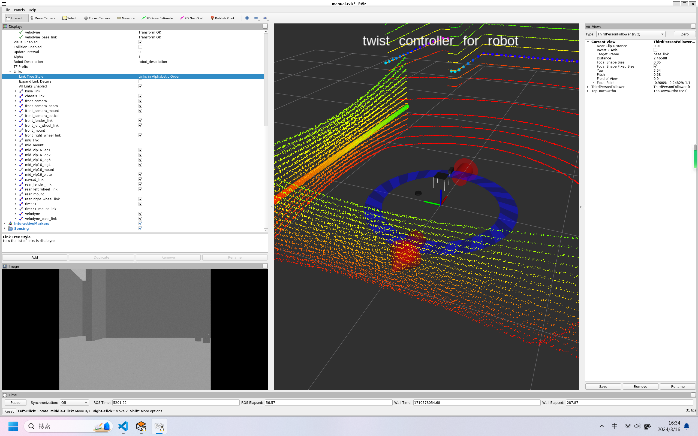

<!-- markdownlint-disable MD024 -->

# ISSUES

> This is a list of issues that I have encountered while working on this project. This list will be updated as I encounter more issues.

## No module named 'defusedxml'

### Description

When I tried to launch the world, I encountered the following error:

```txt
(base) ➜ ~ roslaunch me5413_world world.launch

... logging to /home/ruziniu/.ros/log/983c742a-e2be-11ee-a75d-05540ca94190/roslaunch-LAPTOP-AMOADBB9-14748.log

Checking log directory for disk usage. This may take a while.

Press Ctrl-C to interrupt

Done checking log file disk usage. Usage is <1GB.

xacro: in-order processing became default in ROS Melodic. You can drop the option.

substitution args not supported: No module named 'defusedxml'

when processing file: /home/ruziniu/Projects/ME5413/ME5413_Final_Project_Group10/src/jackal_description/urdf/jackal.urdf.xacro

RLException: while processing /home/ruziniu/Projects/ME5413/ME5413_Final_Project_Group10/src/me5413_world/launch/include/spawn_jackal.launch:

Invalid <param> tag: Cannot load command parameter [robot_description]: command [['/opt/ros/noetic/lib/jackal_description/env_run', '/home/ruziniu/Projects/ME5413/ME5413_Final_Project_Group10/src/jackal_description/urdf/configs/base', '/opt/ros/noetic/lib/xacro/xacro', '/home/ruziniu/Projects/ME5413/ME5413_Final_Project_Group10/src/jackal_description/urdf/jackal.urdf.xacro', '--inorder']] returned with code [2].

Param xml is <param name="robot\_description" command="$(find jackal\_description)/scripts/$(arg env\_runner) $(find jackal\_description)/urdf/configs/$(arg config) $(find xacro)/xacro $(find jackal\_description)/urdf/jackal.urdf.xacro --inorder"/>

The traceback for the exception was written to the log file
```

### Solution

```sh
pip install defusedxml
```

## PluginlibFactory: The plugin for class 'rviz_imu_plugin/Imu' failed to load

### Description

When I run the following command:

```sh
roslaunch me5413_world manual.launch
```

```txt
[ERROR] [1710502706.477927377, 5069.900000000]: PluginlibFactory: The plugin for class 'rviz_imu_plugin/Imu' failed to load.  Error: According to the loaded plugin descriptions the class rviz_imu_plugin/Imu with base class type rviz::Display does not exist. Declared types are  jsk_rviz_plugin/AmbientSound jsk_rviz_plugin/BoundingBox jsk_rviz_plugin/BoundingBoxArray jsk_rviz_plugin/CameraInfo jsk_rviz_plugin/Diagnostics jsk_rviz_plugin/Footstep jsk_rviz_plugin/HumanSkeletonArray jsk_rviz_plugin/LinearGauge jsk_rviz_plugin/NormalDisplay jsk_rviz_plugin/OverlayCamera jsk_rviz_plugin/OverlayDiagnostic jsk_rviz_plugin/OverlayImage jsk_rviz_plugin/OverlayMenu jsk_rviz_plugin/OverlayText jsk_rviz_plugin/PeoplePositionMeasurementArray jsk_rviz_plugin/Pictogram jsk_rviz_plugin/PictogramArray jsk_rviz_plugin/PieChart jsk_rviz_plugin/Plotter2D jsk_rviz_plugin/PolygonArray jsk_rviz_plugin/PoseArray jsk_rviz_plugin/QuietInteractiveMarker jsk_rviz_plugin/RvizScenePublisher jsk_rviz_plugin/SegmentArray jsk_rviz_plugin/SimpleOccupancyGridArray jsk_rviz_plugin/String jsk_rviz_plugin/TFTrajectory jsk_rviz_plugin/TargetVisualizer jsk_rviz_plugin/TorusArray jsk_rviz_plugin/TwistStamped jsk_rviz_plugin/VideoCapture rviz/AccelStamped rviz/Axes rviz/Camera rviz/DepthCloud rviz/Effort rviz/FluidPressure rviz/Grid rviz/GridCells rviz/Illuminance rviz/Image rviz/InteractiveMarkers rviz/LaserScan rviz/Map rviz/Marker rviz/MarkerArray rviz/Odometry rviz/Path rviz/PointCloud rviz/PointCloud2 rviz/PointStamped rviz/Polygon rviz/Pose rviz/PoseArray rviz/PoseWithCovariance rviz/Range rviz/RelativeHumidity rviz/RobotModel rviz/TF rviz/Temperature rviz/TwistStamped rviz/WrenchStamped rviz_plugin_tutorials/Imu rviz_plugins/AerialMapDisplay
```

### Solution

```sh
sudo apt-get install ros-$(rosversion -d)-rviz-imu-plugin
```

## Robot model not showing in `Gazebo` (Conda environment issue)

### Description

When I ran the command `roslaunch me5413_world world.launch`, I found that there was no jackal robot in the `gazebo` environment, shown in the following figure:



### Solution

`Conda` environment was not compatible with `ROS` environment. I had to deactivate the `Conda` environment and then run the `roslaunch me5413_world world.launch` command.

## About `roslaunch me5413_world world.launch`

### Description

When I ran the command `roslaunch me5413_world world.launch`, I encountered the following warning:

```txt
[ERROR] [1710577667.274748041, 5045.474000000]: No p gain specified for pid.  Namespace: /gazebo_ros_control/pid_gains/front_left_wheel
[ERROR] [1710577667.275309938, 5045.474000000]: No p gain specified for pid.  Namespace: /gazebo_ros_control/pid_gains/front_right_wheel
[ERROR] [1710577667.275843672, 5045.474000000]: No p gain specified for pid.  Namespace: /gazebo_ros_control/pid_gains/rear_left_wheel
[ERROR] [1710577667.276348832, 5045.474000000]: No p gain specified for pid.  Namespace: /gazebo_ros_control/pid_gains/rear_right_wheel
```

### Solution

I just ignored it!

## About `roslaunch me5413_world manual.launch`

### Description

When I ran the command `roslaunch me5413_world manual.launch`, I encountered the following warning:

```txt
QMetaObject::connectSlotsByName: No matching signal for on_button_1_1_clicked()
QMetaObject::connectSlotsByName: No matching signal for on_button_1_2_clicked()
QMetaObject::connectSlotsByName: No matching signal for on_button_2_1_clicked()
QMetaObject::connectSlotsByName: No matching signal for on_button_2_2_clicked()
QMetaObject::connectSlotsByName: No matching signal for on_button_2_3_clicked()
QMetaObject::connectSlotsByName: No matching signal for on_button_2_4_clicked()
QMetaObject::connectSlotsByName: No matching signal for on_button_3_1_clicked()
QMetaObject::connectSlotsByName: No matching signal for on_button_3_2_clicked()
QMetaObject::connectSlotsByName: No matching signal for on_button_3_3_clicked()
QMetaObject::connectSlotsByName: No matching signal for on_button_regen_clicked()
QMetaObject::connectSlotsByName: No matching signal for on_button_clear_clicked()
[ WARN] [1710503737.404157136, 6098.975000000]: Interactive marker 'robot_twist_marker' contains unnormalized quaternions. This warning will only be output once but may be true for others; enable DEBUG messages for ros.rviz.quaternions to see more details.
```

### Solution

I just ignored it!

## RobotModel shown in `Rviz` is not complete

### Description

When I ran the command `roslaunch me5413_world manual.launch`, I found that the robot model shown in `Rviz` was not complete, shown in the following figure:



### Solution

> Reference: <https://chenycherry.top/archives/532/ros/wsl2%E8%99%9A%E6%8B%9F%E6%9C%BA%E4%BD%BF%E7%94%A8rviz-%E6%9C%BA%E5%99%A8%E4%BA%BA%E6%A8%A1%E5%9E%8B%E6%97%A0%E6%B3%95%E6%AD%A3%E5%B8%B8%E6%98%BE%E7%A4%BA%E9%97%AE%E9%A2%98/>

```bash
sudo add-apt-repository ppa:kisak/kisak-mesa
sudo apt update && sudo apt upgrade
```

**Reason behind:** `Rviz` display anomaly caused by too low version of `OpenGL` library on `WSL2` `Ubuntu` system.
