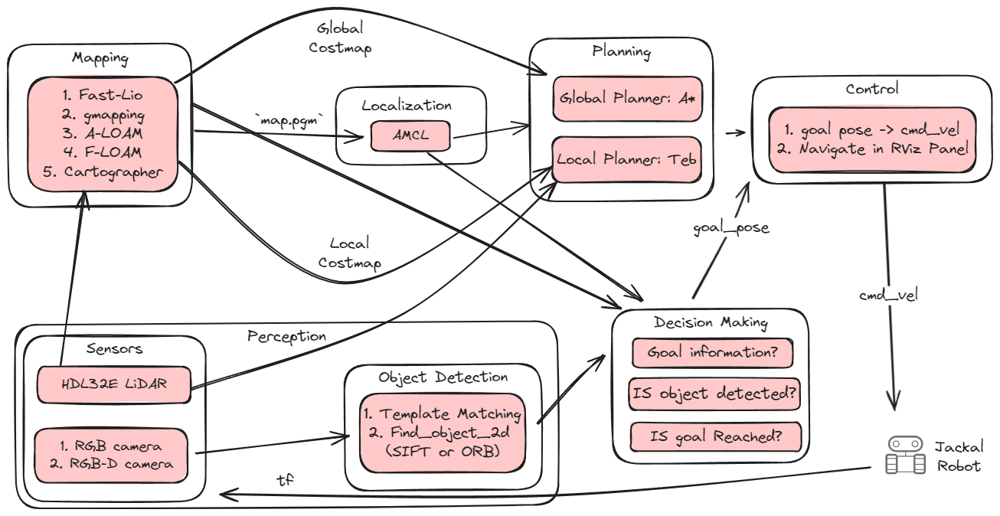
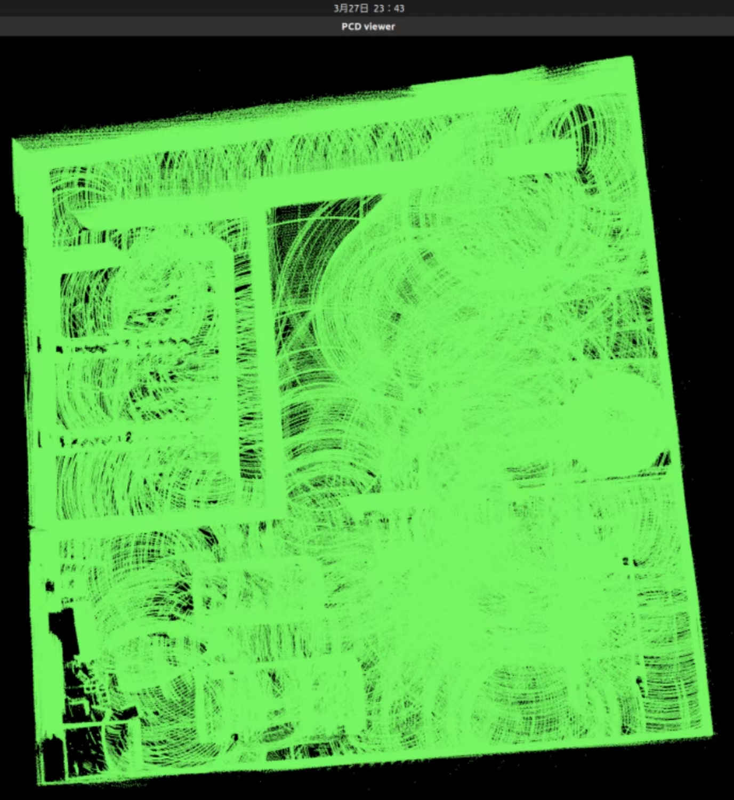
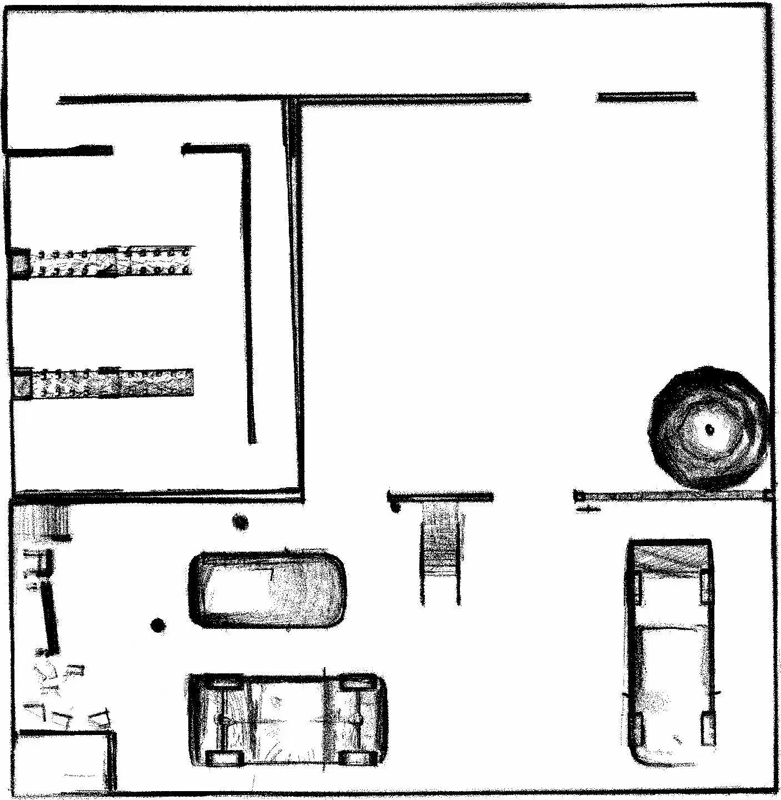
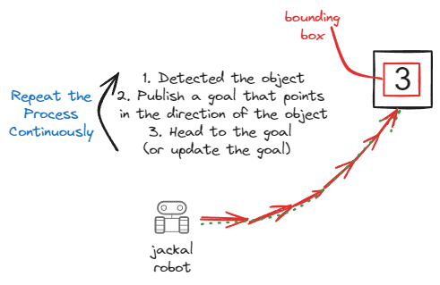
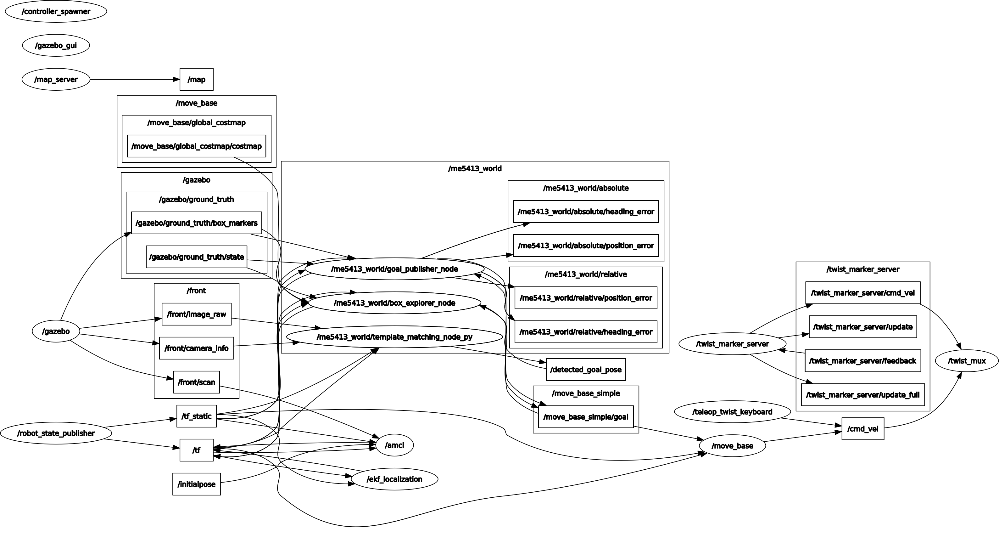
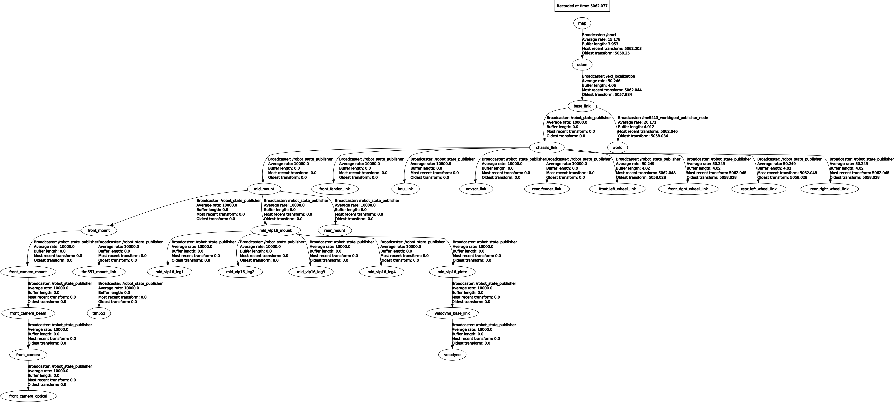

<!-- markdownlint-disable MD024 -->
<!-- markdownlint-disable MD033 -->

# ME5413 Final Project Group 10

> Authors: [Cao Chenyu](https://github.com/ruziniuuuuu), [Li Zhangjin](https://github.com/Lizhangjin), Wang Yuanlong, Zhao Huaiyi, [Zhao Xu](https://github.com/AeroEmbedAutoTechJohn), [Zhu Rong](https://github.com/Celia0731) (_sorted in alphabetical order_)

This is our implementation of the [ME5413_Final_Project](https://github.com/NUS-Advanced-Robotics-Centre/ME5413_Final_Project). For the original project description and instructions, please refer to the [ORIGINAL_README.md](ORIGINAL_README.md) file. The reflections and issues we encountered during the project are recorded in the [REFLECTIONS.md](REFLECTIONS.md) and [ISSUES.md](ISSUES.md) files, respectively.

## Introduction

This project focuses on implementing the Jackal robot to map an environment and navigate to a goal location. As a bonus objective, the robot is required to detect a dynamic object (number 3 on a box) and navigate to its location.

The flowchart below describes the overall process of the project:



The project consists of four main components:

- **Mapping:** The primary mapping method used is the `Fast-Lio` package. Other mapping methods, such as `gmapping`, `Cartographer`, `A-LOAM`, and `F-LOAM`, are also tested for performance comparison.

- **Perception (Object Detection):** Two methods are used to detect the object (number 3 on the box) using the camera information:
  - Template matching method provided by the OpenCV library.
  - The `find_object_2d` package, which uses the `ORB` (Oriented FAST and Rotated BRIEF) method.
  
- **Localization:** Localization is performed using the `AMCL` (Adaptive Monte Carlo Localization) method.

- **Navigation:** The global planner used is `A*`, and the local planner used is `Teb`.

By integrating these components, the Jackal robot is capable of autonomously mapping the environment, detecting the dynamic object, and navigating to the desired goal location.

### Mapping

The mapping process is performed using the `Fast-Lio` package. The `Fast-Lio` package is used as the primary mapping method in this project. After the mapping process, the map is saved as a `.pcd` file, which can be converted to a `.pgm` file for the further navigation process.

The figures below show the mapping results of the `Fast-Lio` package (`.pcd` and `.pgm` files):

<div align="center">
  
  
</div>

#### Global Costmap

- Represents the information of the mapped environment
- Generated by `Fast-Lio` package, providing a `.pgm` map
- Parameters can be tuned in the `jackal_navigation/params/costmap_common_params.yaml` file

#### Local Costmap

- Represents robot's immediate surroundings for local path planning and obstacle avoidance
- Dynamically updated based on sensor data (`laser scans`, `point clouds`)
- Smaller in size and higher resolution compared to global costmap
- Generated and maintained by navigation stack (`move_base`) in real-time
- Continuously updated to react to changes in local environment

#### Prohibition Layer

- Prohibits the robot from entering the area
- Implemented in the `costmap_prohibition_layer` package
- The prohibition area is defined in the `jackal_navigation/params/prohibition_layer.yaml` file

### Object Detection

Two methods are used to detect the object (number 3 on the box) using the camera information:

- **Template Matching Method:** The template matching method is provided by the OpenCV library. The template image is pre-defined, and the object is detected by comparing the template image with the camera image. The implementation details can be found in the `template_matching_node_py.py` file. (`template_matching_node.cpp` as the C++ version)
- **Feature-based Method:** The `find_object_2d` package is used to detect the object. The `ORB` (Oriented FAST and Rotated BRIEF) or `SIFT` method is used for object detection. We launch the `find_object_2d` package in the `find_box.launch` file. Another our own implementation of the `SIFT` method can be found in the `sift_detection_node_py.py` file.

We have considered two approaches for navigating to the detected object:

- The first one is **to use a RGB-D camera instead of the original non-depth camera**, which we can directly get the depth information of the object. Then we can use the depth information to calculate the distance between the robot and the object. This method is more accurate and efficient.
- The second one is **to keep the original non-depth camera and give a dummy depth information** to the detected object (a very small distance). Then we can navigate to the detected object by only using the 2D image information. This method is less accurate and may cause the robot to collide with obstacles.

The following figure shows the basic process of our second approch:



### Localization

The localization process is performed using the `AMCL` (Adaptive Monte Carlo Localization) method. The `AMCL` package is used to localize the robot in the map. The `AMCL` node is launched in the `amcl.launch` file, and the parameters of the `AMCL` package can be tuned in the `jackal_navigation/params/amcl_params.yaml` file.

### Navigation

The navigation process consists of two parts: global planning and local planning.

- **Global Planning:** The global planner used is `A*`. The `move_base` package is used to perform the global planning process. The global planner parameters can be tuned in the `jackal_navigation/params/global_planner_params.yaml` file.
- **Local Planning:** The local planner used is `Teb`. The `move_base` package is used to perform the local planning process. The local planner parameters can be tuned in the `jackal_navigation/params/teb_local_planner_params.yaml` file.

## Project Structure

### Implementation Logic

The implementation logic of the project is shown in the flowchart below:


### ROS Graph

The ROS graph of the project is shown below:



### TF Tree

The TF tree of the project is shown below:



### Repo Tree

```plaintext
ME5413_Final_Project_Group10
├── README.md
├── ORIGINAL_README.md
├── assets -> Images and figures used in the README
├── src
│   ├── costmap_prohibition_layer -> Prohibit the robot from entering the area
│   ├── pcd_to_map -> Convert pcd file to map 
│   ├── FAST-LIO -> Fast-Lio mapping
│   ├── livox_ros_driver -> Livox LIDAR driver (necessary for Fast-Lio)
│   ├── interactive_tools -> Interactive tools for manipulating RViz panels
│   ├── jackal_description -> Jackal robot description
│   ├── jackal_navigation -> Jackal navigation
│   ├── me5413_world -> Main implementations of the project
│   │   ├── include -> Header files
│   │   │   ├── me5413_world -> Header files for the main implementations
│   │   ├── launch -> Launch files
│   │   │   ├── amcl.launch
│   │   │   ├── fast_lio.launch
│   │   │   ├── find_box.launch
│   │   │   ├── include
│   │   │   │   └── spawn_jackal.launch
│   │   │   ├── main.launch
│   │   │   ├── manual.launch
│   │   │   ├── mapping.launch
│   │   │   ├── move_base.launch
│   │   │   ├── navigation.launch
│   │   │   └── world.launch  
│   │   ├── src -> C++ scripts
│   │   │   ├── object_spawner_gz_plugin.cpp -> Gazebo plugin for spawning the object (boxes and cones)
│   │   │   ├── goal_publisher_node.cpp -> Publish the goal location (when goal is not box)
│   │   │   ├── box_explore_node.cpp -> Explore the box location (when goal is box)
│   │   │   └── template_matching.cpp -> Template matching method for object detection
│   │   └── scripts -> Python scripts  
│   │       ├── sift_detection_node_py.py -> SIFT method for object detection
│   │       └── template_matching_node_py.py -> Template matching method for object detection
```

Some other packages used in this project are not included in this repo. Please refer to the installation section for more information.

## Installation

First, clone this repository into your workspace:

```bash
cd ~
git clone https://github.com/ruziniuuuuu/ME5413_Final_Project_Group10.git
cd ME5413_Final_Project_Group10
```

Then, install all dependencies:

```bash
rosdep install --from-paths src --ignore-src -r -y
```

Finally, build the workspace:

```bash
catkin_make
source devel/setup.bash
```

To properly load the gazebo world, you will need to have the necessary model files in the `~/.gazebo/models/` directory.

There are two sources of models needed:

- [Gazebo official models](https://github.com/osrf/gazebo_models)
  
  ```bash
  # Create the destination directory
  cd
  mkdir -p .gazebo/models

  # Clone the official gazebo models repo (assuming home here `~/`)
  git clone https://github.com/osrf/gazebo_models.git

  # Copy the models into the `~/.gazebo/models` directory
  cp -r ~/gazebo_models/* ~/.gazebo/models
  ```

- [Our customized models](https://github.com/NUS-Advanced-Robotics-Centre/ME5413_Final_Project/tree/main/src/me5413_world/models)

  ```bash
  # Copy the customized models into the `~/.gazebo/models` directory
  cp -r ~/ME5413_Final_Project/src/me5413_world/models/* ~/.gazebo/models
  ```

Other than the packages provided in the original project description, the following packages are also required:

- Teb Local Planner

    ```bash
    sudo apt-get install ros-noetic-teb-local-planner
    ```

- find_object_2d

    ```bash
    sudo apt-get install ros-noetic-find-object-2d
    ```

## Usage

After the installation, you can run the project by executing the following commands:

```bash
roslaunch me5413_world main.launch
```

## TODO

### Mapping

- [x] Implement the `Fast-Lio`, `gmapping`, `Cartographer`, `A-LOAM`, and `F-LOAM` mapping methods.
- [x] Save the best map as a `.pgm` file. (mapped by `Fast-Lio`)
- [ ] Record the mapping process to a ros bag file.
- [ ] Deploy or design a randomly exploration policy to autonomously map the environment.

### Object Detection

- [x] Implement the template matching method for object detection.
- [x] Implement the `ORB` or `SIFT` method for object detection. (`find_object_2d`)
- [ ] Train a YOLO detctor for object detection. (may be trained from a small `mnist` dataset)
- [ ] Attempt to use the RGB-D camera to detect the object.
- [ ] Attempt to use the stereo camera to detect the object.
- [ ] Capture the `cone` in the gazebo world from the camera.

### Localization

- [x] Implement the `AMCL` method for localization.
- [x] Tune the parameters of the `AMCL` package to get better localization results.
- [ ] Solve the drifting problem in localization.

### Planning

- [x] Implement the `A*` global planner.
- [x] Implement the `Teb` local planner.
  - [x] Tune the parameters of the `Teb` local planner to get better navigation results.
  - [x] Avoid the dynamic object when navigating to the goal location. (boxes and cones)
- [x] Successfully navigate the robot to the goal location.
- [ ] Change the global planner to other planners (`GBFS` or `RRT*`) and compare the performance.
- [ ] Change the local planner to other planners (`DWA` or `EBand`) and compare the performance.

## Acknowledgements

We would like to express our gratitude to the teaching team of ME5413 for providing us with the opportunity to work on this project!!! :kissing_heart:

- [CppRobotics](https://github.com/onlytailei/CppRobotics.git): A collection of robotics algorithms implemented in C++.
- [PythonRobotics](https://github.com/AtsushiSakai/PythonRobotics.git): A collection of robotics algorithms implemented in Python.
- [Fast-LIO](https://github.com/hku-mars/FAST_LIO.git): A computationally efficient and robust LiDAR-inertial odometry package by hku-mars group.
- [pcd2pgm_package](https://github.com/Hinson-A/pcd2pgm_package.git): A package for converting `.pcd` files to `.pgm` files.

## License

This project is licensed under the MIT License. For more information, please refer to the [LICENSE](LICENSE) file.
