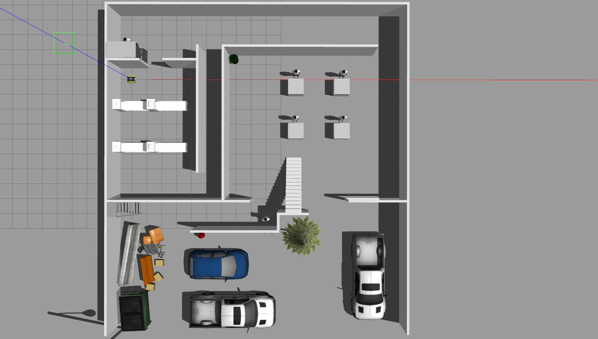
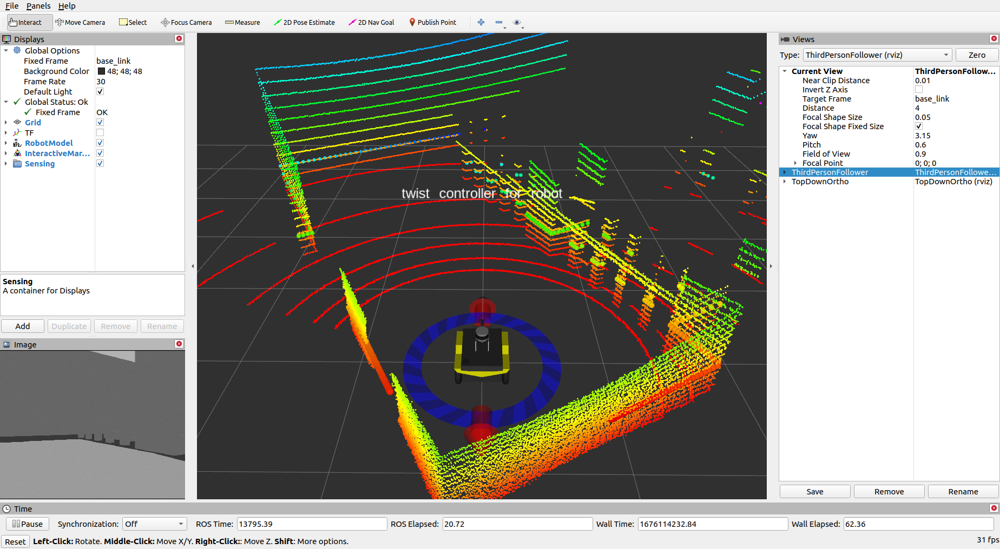

# ME5413_Final_Project

NUS ME5413 Autonomous Mobile Robotics Final Project


## Dependencies

* System Requirements:
  * Ubuntu 20.04 (18.04 not yet tested)
  * ROS Noetic (Melodic not yet tested)
  * C++11 and above
  * CMake: 3.0.2 and above
* This repo depends on the following standard ROS pkgs:
  * `roscpp`
  * `rospy`
  * `rviz`
  * `std_msgs`
  * `nav_msgs`
  * `geometry_msgs`
  * `visualization_msgs`
  * `tf2`
  * `tf2_ros`
  * `tf2_geometry_msgs`
  * `pluginlib`
  * `map_server`
  * `gazebo_ros`
  * `jsk_rviz_plugins`
  * `jackal_gazebo`
  * `jackal_navigation`
  * `velodyne_simulator`
  * `teleop_twist_keyboard`
  * `spatio-temporal-voxel-layer`
* And this [gazebo_model](https://github.com/osrf/gazebo_models) repositiory


<br/>

## Installation

This repo is a ros workspace, containing four rospkgs:

* `interactive_tools` are customized tools to interact with gazebo and your robot
* `jackal_description` contains the modified jackal robot model descriptions
* `me5413_world` the main pkg containing the gazebo world, and the launch files
* `costmap_prohibition_layer` the pkg for generating the restricted area in move_base global planner


<br/>

### Clone the repo and build

```bash
# Clone the repo (assuming home here `~/`)
cd
git clone https://github.com/ljw19970/ME5413_Final_Project.git
cd ME5413_Final_Project

# Install all dependencies
rosdep install --from-paths src --ignore-src -r -y

# Build
catkin_make
# Source 
source devel/setup.bash
```


<br/>

### Installation of Gazabo models

To properly load the gazebo world, you will need to have the necessary model files in the `~/.gazebo/models/` directory.

There are two sources of models needed:

* [Gazebo official models](https://github.com/osrf/gazebo_models)
  
  ```bash
  # Create the destination directory
  cd
  mkdir -p .gazebo/models

  # Clone the official gazebo models repo (assuming home here `~/`)
  git clone https://github.com/osrf/gazebo_models.git

  # Copy the models into the `~/.gazebo/models` directory
  cp -r ~/gazebo_models/* ~/.gazebo/models
  ```

* [Our customized models](https://github.com/NUS-Advanced-Robotics-Centre/ME5413_Final_Project/tree/main/src/me5413_world/models)

  ```bash
  # Copy the customized models into the `~/.gazebo/models` directory
  cp -r ~/ME5413_Final_Project/src/me5413_world/models/* ~/.gazebo/models
  ```


<br/>

### Installation of Cartographer

Install the Cartographer, follow [Cartographer Installation](https://google-cartographer-ros.readthedocs.io/en/latest/compilation.html)

after installing the Cartographer, copy the .lua files in folder `/cartographer/configurations` to the `${YourCartographer_ws}/install_isolated/share/cartographer_ros/configuration_files`


<br/>

### Installation of A-LOAM

Install the Cartographer, follow [A-LOAM Installation](https://github.com/nuslde/aloam_lidar_odom_result_generate)

modify the 3d-lidar topic in file scanRegistration.cpp from /velodyne_points to /mid/points in main function


<br/>

### Installation of pcd2pgm

```bash
# Clone the code
cd
git clone https://github.com/Hinson-A/pcd2pgm_package.git
cd pcd2pgm_package

# Build
catkin_make
```

open the pcd_to_pgm_ws/src/pcd2pgm_package/pcd2pgm/launch/run.launch, modify the following parameters 

- `file_directory`: the path where the .pcd file is stored, for example /home/lee/Resources/control_cmd/pcd2pgm/
- `file_name`: the .pcd file name
- `thre_z_min`: the minimum height of the points. The points within the range thre_z_min and thre_z_max will be reserved, otherwise will be filtered
- `thre_z_max`: the maximum height of the points


<br/>

## Usage

### Launch Gazabo World

This command will launch the gazebo with the project world

```bash
# Launch Gazebo World together with our robot
roslaunch me5413_world world.launch
```



<br/>

### Manual Control 

If you wish to explore the gazebo world a bit, we provide you a way to manually control the robot around:

```bash
# Only launch the robot keyboard teleop control
roslaunch me5413_world manual.launch
```

**Note:** This robot keyboard teleop control is also included in all other launch files, so you don't need to launch this when you do mapping or navigation.




<br/>

### Mapping using A-LOAM

#### Directly Run

After launching the Gazabo world, running the following command in the second terminal:

```bash
# change to your A-LOAM workspace
source devel/setup.bash

# run the A-LOAM
roslaunch aloam_velodyne aloam_velodyne_VLP_16.launch
```


#### Rosbag Example

Firstly, launch the A-LOAM program in the first terminal

```bash
# change to your A-LOAM workspace
source devel/setup.bash

# run the A-LOAM
roslaunch aloam_velodyne aloam_velodyne_VLP_16.launch
```

Then play your rosbag in the second terminal

```bash
# play your rosbag
rosbag play yourrosbag.bag
```


<br/>

#### Save A-LOAM Result

Before A-LOAM finishing mapping, run the following command in the thrid terminal  to record the 3D SLAM result

```bash
# record the /laser_cloud_surrod which contains the 3D SLAM result
# save the rosbag as 'alom_result'
rosbag record -O alom_result.bag out /laser_cloud_surround

# change the 3D SLAM result '/laser_cloud_surround' to 'pcd' files in folder 'mypcd'
rosrun pcl_ros bag_to_pcd alom_result.bag /laser_cloud_surround mypcd
```

There might be many pcd files in 'mypcd' folder depending on the time length of your bag and the file name is named with timestamp in the bag. The pcd file can be viewed by using following command

```bash
pcl_viewer yourfilename.pcd
```


<br/>

#### Convert PCD to PGM

Choose the pcd file with the latest timestamp and modify the pcd2pgm parameters according to the chapter **'Installation of pcd2pgm_package'**, and then run the following command

```bash
# launch the pcd2pgm program
cd
cd pcd2pgm_package
source devel/setup.bash
roslaunch pcd2pgm run.launch
```

then run the following command to save the 2D map in the second terminal

```bash
# save the 'map'
roscd me5413_world/maps/
rosrun map_server map_saver -f my_map map:=/map
```


<br/>

### Navigation using Cartographer

Once completed **Step 2** mapping and saved your map, quit the mapping process

Before the navigation, please ensure the Gazebo world has been launched

Then, in the second terminal:

```bash
# Load a map and launch Cartographer localizer
source ${YourCartographer_ws}/devel_isolated/cartographer_ros/setup.bash
roslaunch me5413_world navigation_test.launch
```


<br/>

## License

The [ME5413_Final_Project](https://github.com/NUS-Advanced-Robotics-Centre/ME5413_Final_Project) is released under the [MIT License](https://github.com/NUS-Advanced-Robotics-Centre/ME5413_Final_Project/blob/main/LICENSE)