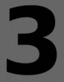
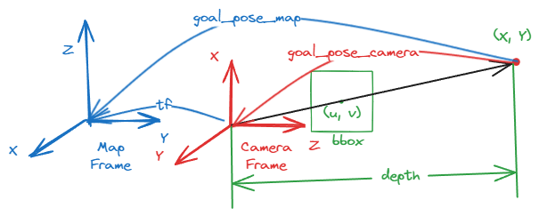

<!-- markdownlint-disable MD024 -->
<!-- markdownlint-disable MD033 -->

# ME5413 Final Project Group 10

> Authors: [Cao Chenyu](https://github.com/ruziniuuuuu), [Li Zhangjin](https://github.com/Lizhangjin), Wang Yuanlong, Zhao Huaiyi, [Zhao Xu](https://github.com/AeroEmbedAutoTechJohn), [Zhu Rong](https://github.com/Celia0731) (_sorted in alphabetical order_)

This is our implementation of the [ME5413_Final_Project](https://github.com/NUS-Advanced-Robotics-Centre/ME5413_Final_Project). For the original project description and instructions, please refer to the [ORIGINAL_README.md](ORIGINAL_README.md) file. The reflections and issues we encountered during the project are recorded in the [REFLECTIONS.md](REFLECTIONS.md) and [ISSUES.md](ISSUES.md) files, respectively.

## Introduction

This project focuses on implementing the Jackal robot to map an environment and navigate to a goal location. As a bonus objective, the robot is required to detect a dynamic object (number 3 on a box) and navigate to its location.

The flowchart below describes the overall process of the project:


The project consists of six main components:

- **Mapping:** The primary mapping method used is the `Fast-Lio` package. Other mapping methods, such as `gmapping`, `Cartographer`, `A-LOAM`, and `F-LOAM`, are also tested for performance comparison.

- **Perception (Object Detection):** Two methods are used to detect the object (number 3 on the box) using the camera information:
  - Template matching method provided by the OpenCV library.
  - The `find_object_2d` package, which uses the `ORB` (Oriented FAST and Rotated BRIEF) and `SIFT` methods for object detection.
  
- **Localization:** Localization is performed using the `AMCL` (Adaptive Monte Carlo Localization) method.

- **Planning:** The global planner used is `A*`, and the local planner used is `Teb`.

- **Decision Making:** The decision-making modules decides how to get to the desired goal location based on the goal information and the detected object information.

By integrating these components, the Jackal robot is capable of autonomously mapping the environment, detecting the dynamic object, and navigating to the desired goal location.

### Mapping

The mapping process is performed using the `Fast-Lio` package. The `Fast-Lio` package is used as the primary mapping method in this project. After the mapping process, the map is saved as a `.pcd` file, which can be converted to a `.pgm` file for the further navigation process.

The figures below show the mapping results of the `Fast-Lio` package (`.pcd` and `.pgm` files):

<div>
  
  
</div>

### Object Detection

Two methods are used to detect the object (number 3 on the box) using the camera information:

- **Template Matching Method:** The template matching method is provided by the OpenCV library. The template image is pre-defined, and the object is detected by comparing the template image with the camera image. The implementation details can be found in the `template_matching_node_py.py` file. (`template_matching_node.cpp` as the C++ version)
- **Feature-based Method:** The `find_object_2d` package is used to detect the object. The `ORB` (Oriented FAST and Rotated BRIEF) or `SIFT` method is used for object detection. We launch the `find_object_2d` package in the `find_box.launch` file. Another our own implementation of the `SIFT` method can be found in the `sift_detection_node_py.py` file.

The following figures show the templates we used for the object detection:

<div>
  
  
  
  
</div>

We have considered two approaches for navigating to the detected object:

- The first one is **to use a RGB-D camera instead of the original non-depth camera**, which we can directly get the depth information of the object. Then we can use the depth information to calculate the distance between the robot and the object. This method is more accurate and efficient.
- The second one is **to keep the original non-depth camera and give a dummy depth information** to the detected object (a very small distance). Then we can navigate to the detected object by only using the 2D image information. This method is less accurate and may cause the robot to collide with obstacles.

The following figure shows the basic process of our second approch:


#### Camera Calibration Policy

After detecting the object, we need to calculate the distance between the robot and the object and estimate the pose of the object in the map frame. The camera calibration process is achived in the `calculate_target()` function, once the robot captures a bounding box, the function will be called to calculate the distance and pose of the object. A basic process is shown in the figure below:



First, we obtain the coordinates $(u, v)$ of the target in the image, which are the center coordinates of the bounding box:

$$
u = \text{bbox.x} + \frac{\text{bbox.width}}{2}
$$

$$
v = \text{bbox.y} + \frac{\text{bbox.height}}{2}
$$

Next, we retrieve the depth value $Z$ at that point by accessing the corresponding pixel in the depth image:

$$
Z = \text{cv\_depth\_image\_.at<float>}(v, u)
$$

Then, we use the camera intrinsic matrix $K$ to convert the image coordinates $(u, v)$ and depth value $Z$ to the 3D point $(X, Y, Z)$ in the camera coordinate system. The camera intrinsic matrix $K$ is defined as follows:

$$
\mathbf{K} = \begin{bmatrix}
f_x & 0 & c_x \\
0 & f_y & c_y \\
0 & 0 & 1
\end{bmatrix}
$$

Using the camera intrinsic matrix, we can calculate the 3D point $(X, Y, Z)$ in the camera coordinate system using the following formulas:

$$
X = \frac{(u - c_x) \cdot Z}{f_x}
$$

$$
Y = \frac{(v - c_y) \cdot Z}{f_y}
$$

In the code, this step corresponds to the following part:

```cpp
cv::Point3f target_point;
target_point.x = (bbox.x + bbox.width / 2 - camera_matrix_.at<double>(0, 2)) * depth / camera_matrix_.at<double>(0, 0);
target_point.y = (bbox.y + bbox.height / 2 - camera_matrix_.at<double>(1, 2)) * depth / camera_matrix_.at<double>(1, 1);
target_point.z = depth;
```

Finally, we use the tf library to transform the 3D point $(X, Y, Z)$ from the camera coordinate system to the map coordinate system and publish it as the target location.

Through these steps, we utilize the camera calibration parameters to convert the target location in the image to a 3D point in the camera coordinate system and further transform it to the target location in the map coordinate system, enabling the robot to navigate to that location.

### Localization

The localization process is performed using the `AMCL` (Adaptive Monte Carlo Localization) method. The `AMCL` package is used to localize the robot in the map. The `AMCL` node is launched in the `amcl.launch` file, and the parameters of the `AMCL` package can be tuned in the `jackal_navigation/params/amcl_params.yaml` file.

### Planning

The planning process consists of two parts: global planning and local planning.

- **Global Planning:** The global planner used is `A*`. The global planner parameters can be tuned in the `jackal_navigation/params/global_planner_params.yaml` file.
- **Local Planning:** The local planner used is `Teb`. The local planner parameters can be tuned in the `jackal_navigation/params/teb_local_planner_params.yaml` file.

#### Costmap

The planning process is based on the costmap information. The costmap consists of two parts: global costmap and local costmap.

- **The global costmap** represents the information of the mapped environment and is generated by the `Fast-Lio` package. The parameters for the global costmap can be tuned in the `jackal_navigation/params/costmap_common_params.yaml` file. This costmap serves as a comprehensive representation of the robot's surroundings.

- **The local costmap** represents the robot's immediate surroundings and is used for local path planning and obstacle avoidance. It is dynamically updated based on sensor data, such as laser scans and point clouds, and is smaller in size and has a higher resolution compared to the global costmap.

Besides, we are required to prohibit the robot from entering some specific areas, which can be achieved by using the `costmap_prohibition_layer` package. The prohibition area is defined in the `jackal_navigation/params/prohibition_layer.yaml` file, which stands for the `Restricted Area`. We have also implemented a script `dynamic_obstacle_updater.py` which could subsribe `/gazebo/cone_position` and then update the prohibition area based on the position of the cone. (reason: the cone is randomly spawned in two posions, which means that there are two possibilities of the `Blockade` area)

### Decision Making

The decision making logic is shown in the flowchart below:


We have mainly used three nodes to implement the decision (i.e. How to get to the desired goal) logic:

- `goal_publisher_node`: Publish the goal location (when the goal is not a box). The robot will navigate to the goal location directly.
- `box_explorer_node`: Explore the box location (when the goal is a box). The robot will navigate to the boxes area (where the boxes are spawned) and explore the box location randomly until the box is detected.
- `template_matching_node`: Continuously detect the object (number 3 on the box) using the template matching method. If the object is detected, the robot will navigate to the object location.

#### Random Exploration Policy

The random exploration policy is implemented in the `box_explorer_node.cpp` file. A basic process is shown in the figure below:


First, we need to randomly select a `goal_pose` in the boxes are, which is implemented in the `createWaypoints()` and `updateCurrentWaypoint()`. Then we need to check where the selected `goal_pose` has collides with the obstacles, which is implemented in the `isPointInObstacle` function. If the `goal_pose` is not in the obstacles, we can navigate to the `goal_pose` directly, if not we need to select another `goal_pose`. The robot will keep exploring the box location until the object is detected.

#### Collision Checking Policy

In the random exploration process, we need to check whether the selected `goal_pose` is in the obstacles. Initially, we had an idea to subsribe the `/gazebo/global_costmap` and use a circular collision checking method to to check whether the `goal_pose` is in the obstacles. However, we found that the global costmap does not contain the information of the spawned boxes, so the method can not work properly.

Then we implemented the function by subscribing the `box_markers` topic and decided whether the random selected `goal_pose` is near these `box_poses` location. The function is implemented in the `isPointInObstacle()` function (in `box_explorer_node.cpp`).

## Project Structure

```plaintext
ME5413_Final_Project_Group10
├── README.md
├── ORIGINAL_README.md
├── assets -> Images and figures used in the README
├── src
│   ├── costmap_prohibition_layer -> Prohibit the robot from entering the area
│   ├── pcd_to_map -> Convert pcd file to map 
│   ├── FAST-LIO -> Fast-Lio mapping
│   ├── livox_ros_driver -> Livox LIDAR driver (necessary for Fast-Lio)
│   ├── interactive_tools -> Interactive tools for manipulating RViz panels
│   ├── jackal_description -> Jackal robot description
│   ├── jackal_navigation -> Jackal navigation
│   ├── me5413_world -> Main implementations of the project
│   │   ├── include -> Header files
│   │   │   ├── me5413_world -> Header files for the main implementations
│   │   ├── launch -> Launch files
│   │   │   ├── amcl.launch -> Launch the AMCL node
│   │   │   ├── fast_lio.launch -> Launch the Fast-Lio mapping
│   │   │   ├── find_box.launch -> Launch the find_object_2d package
│   │   │   ├── include
│   │   │   │   └── spawn_jackal.launch
│   │   │   ├── main.launch -> Main launch file
│   │   │   ├── manual.launch -> Manually control the robot in the Gazebo world
│   │   │   ├── mapping.launch -> Launch the mapping process
│   │   │   ├── move_base.launch -> Launch the global and local planner
│   │   │   ├── navigation.launch -> Launch the navigation process
│   │   │   └── world.launch -> Launch the Gazebo world
│   │   ├── src -> C++ scripts
│   │   │   ├── object_spawner_gz_plugin.cpp -> Gazebo plugin for spawning the object (boxes and cones)
│   │   │   ├── goal_publisher_node.cpp -> Publish the goal location (when goal is not box)
│   │   │   ├── box_explore_node.cpp -> Explore the box location (when goal is box)
│   │   │   └── template_matching.cpp -> Template matching method for object detection
│   │   └── scripts -> Python scripts  
│   │       ├── sift_detection_node_py.py -> SIFT method for object detection
│   │       └── template_matching_node_py.py -> Template matching method for object detection
│   |       └── dynamic_obstacle_updater.py -> Update the prohibition area based on the position of the cone
```

Some other packages used in this project are not included in this repo. Please refer to the installation section for more information.

## Installation

First, clone this repository into your workspace:

```bash
cd ~
git clone https://github.com/ruziniuuuuu/ME5413_Final_Project_Group10.git
cd ME5413_Final_Project_Group10
```

Then, install all dependencies:

```bash
rosdep install --from-paths src --ignore-src -r -y
```

Finally, build the workspace:

```bash
catkin_make
source devel/setup.bash
```

To properly load the gazebo world, you will need to have the necessary model files in the `~/.gazebo/models/` directory.

There are two sources of models needed:

- [Gazebo official models](https://github.com/osrf/gazebo_models)
  
  ```bash
  # Create the destination directory
  cd
  mkdir -p .gazebo/models

  # Clone the official gazebo models repo (assuming home here `~/`)
  git clone https://github.com/osrf/gazebo_models.git

  # Copy the models into the `~/.gazebo/models` directory
  cp -r ~/gazebo_models/* ~/.gazebo/models
  ```

- [Our customized models](https://github.com/NUS-Advanced-Robotics-Centre/ME5413_Final_Project/tree/main/src/me5413_world/models)

  ```bash
  # Copy the customized models into the `~/.gazebo/models` directory
  cp -r ~/ME5413_Final_Project/src/me5413_world/models/* ~/.gazebo/models
  ```

Other than the packages provided in the original project description, the following packages are also required:

- Teb Local Planner

    ```bash
    sudo apt-get install ros-noetic-teb-local-planner
    ```

- find_object_2d

    ```bash
    sudo apt-get install ros-noetic-find-object-2d
    ```

## Usage

After the installation, you can run the project by executing the following commands:

```bash
roslaunch me5413_world main.launch
```

## TODO

### Mapping

- [x] Implement the `Fast-Lio`, `gmapping`, `Cartographer`, `A-LOAM`, and `F-LOAM` mapping methods.
- [x] Save the best map as a `.pgm` file. (mapped by `Fast-Lio`)
- [ ] Record the mapping process to a ros bag file.
- [ ] Deploy or design a randomly exploration policy to autonomously map the environment.

### Object Detection

- [x] Implement the template matching method for object detection.
- [x] Implement the `ORB` or `SIFT` method for object detection. (`find_object_2d`)
- [ ] Train a YOLO detctor for object detection. (may be trained from a small `mnist` dataset)
- [ ] Attempt to use the RGB-D camera to detect the object.
- [ ] Attempt to use the stereo camera to detect the object.
- [ ] Capture the `cone` in the gazebo world from the camera.

### Localization

- [x] Implement the `AMCL` method for localization.
- [x] Tune the parameters of the `AMCL` package to get better localization results.
- [ ] Solve the drifting problem in localization.

### Planning

- [x] Implement the `A*` global planner.
- [x] Implement the `Teb` local planner.
  - [x] Tune the parameters of the `Teb` local planner to get better navigation results.
  - [x] Avoid the dynamic object when navigating to the goal location. (boxes and cones)
- [x] Successfully navigate the robot to the goal location.
- [ ] Change the global planner to other planners (`GBFS` or `RRT*`) and compare the performance.
- [ ] Change the local planner to other planners (`DWA` or `EBand`) and compare the performance.

## Appendix

### ROS Graph


### TF Tree


## Acknowledgements

We would like to express our gratitude to the teaching team of ME5413 for providing us with the opportunity to work on this project!!! :kissing_heart:

- [CppRobotics](https://github.com/onlytailei/CppRobotics.git): A collection of robotics algorithms implemented in C++.
- [PythonRobotics](https://github.com/AtsushiSakai/PythonRobotics.git): A collection of robotics algorithms implemented in Python.
- [Fast-LIO](https://github.com/hku-mars/FAST_LIO.git): A computationally efficient and robust LiDAR-inertial odometry package by hku-mars group.
- [pcd2pgm_package](https://github.com/Hinson-A/pcd2pgm_package.git): A package for converting `.pcd` files to `.pgm` files.
- [costmap_prohibition_layer](https://github.com/rst-tu-dortmund/costmap_prohibition_layer.git): A package for prohibiting the robot from entering the area.
- [excalidraw](https://github.com/excalidraw/excalidraw.git): A whiteboard tool that lets you easily sketch diagrams that have a hand-drawn feel to them.

## License

This project is licensed under the MIT License. For more information, please refer to the [LICENSE](LICENSE) file.
